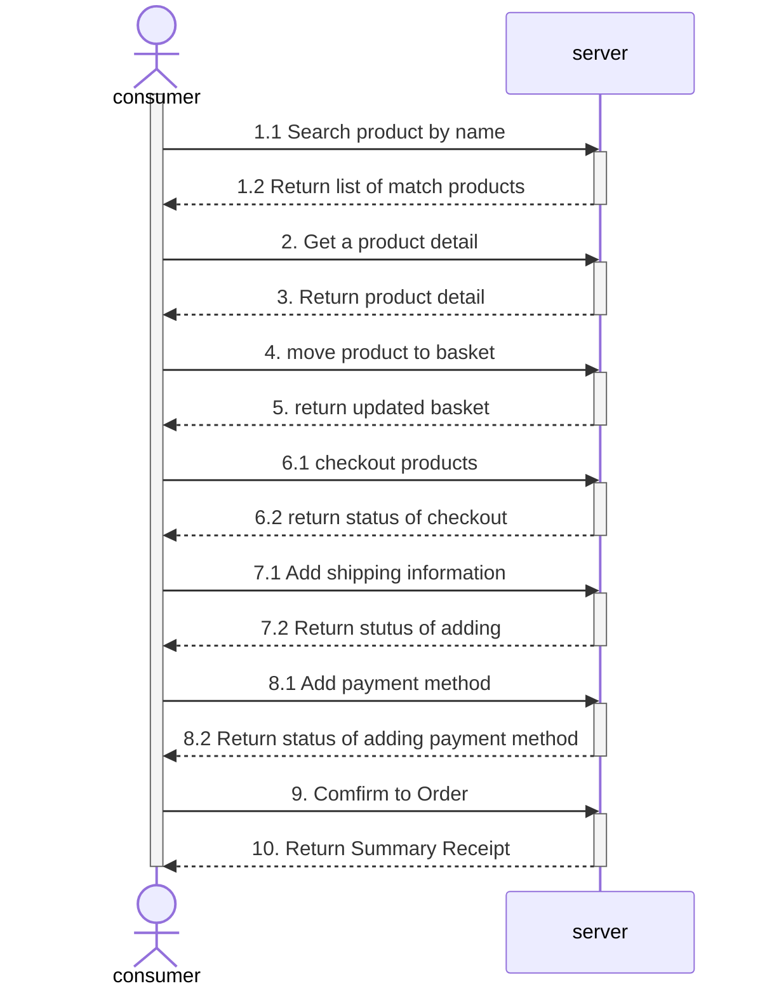

## Shopping Flow Design

```mermaid
sequenceDiagram
    actor consumer
    participant server
    
    activate consumer
    consumer->>server: 1.1 Search product by name
    activate server
    server-->>consumer: 1.2 Return list of match products
    deactivate server
     
    consumer->>server: 2. Get a product detail
    activate server
    server-->>consumer: 3. Return product detail
    deactivate server
    
    consumer->>server: 4. move product to basket
    activate server
    server-->>consumer: 5. return updated basket
    deactivate server
    
    consumer->>server: 6.1 checkout products
    activate server
    server-->>consumer: 6.2 return status of checkout
    deactivate server
    
    consumer->>server: 7.1 Add shipping information
    activate server
    server-->>consumer: 7.2 Return stutus of adding
    deactivate server
    
    consumer->>server: 8.1 Add payment method
    activate server
    server-->>consumer: 8.2 Return status of adding payment method
    deactivate server
    
    consumer->>server: 9. Comfirm to Order
    activate server
    server-->>consumer: 10. Return Summary Receipt
    deactivate server
    
    deactivate consumer
```

 #APIs Design

 

# Models