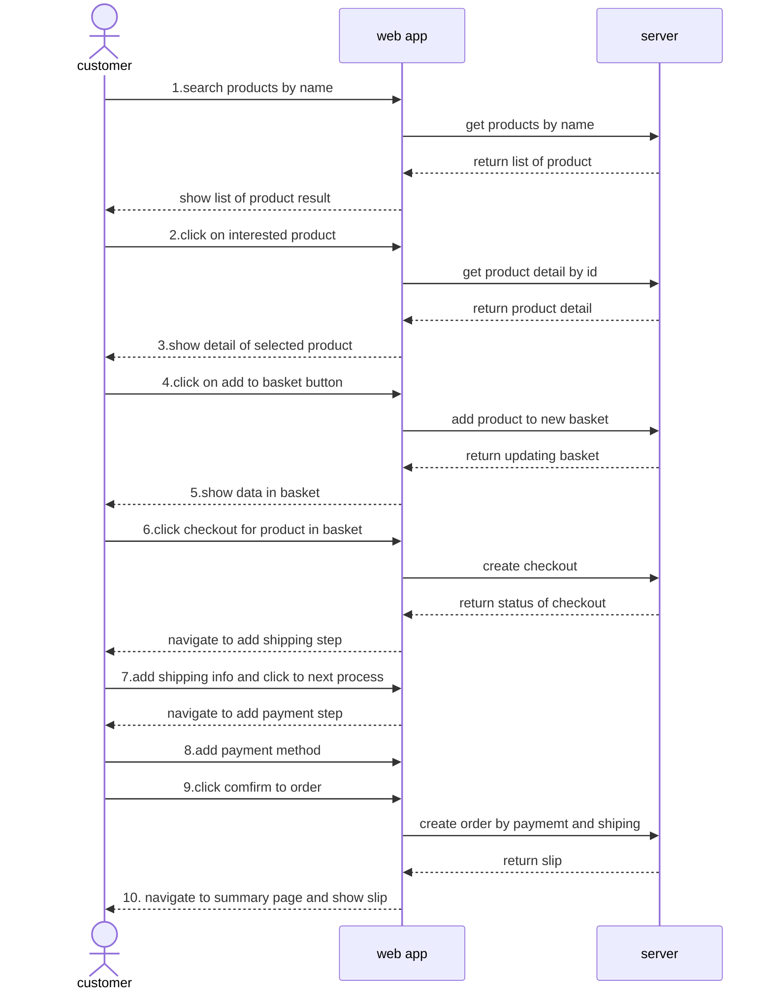

## Shopping Flow Design

 ## APIs Design

### Products
| Description        | Method | URI                   |
|--------------------|--------|-----------------------|
| Get all products   | GET    | /products             |
| Get product detail | GET    | /products/{productId} |

### Baskets
| Description               | Method | URI                          |
|---------------------------|--------|------------------------------|
| Get basket by id          | GET    | /baskets/{basketId}          |
| Create basket             | POST   | /baskets                     |
| Update product on  basket | UPDATE | /baskets/{basketId}/products |

### Checkout
| Description        | Method | URI       |
|--------------------|--------|-----------|
| checkout products  | POST   | /checkout |

### Orders
| Description                              | Method | URI     |
|------------------------------------------|--------|---------|
| create new order by payment and shipping | POST   | /Orders |

# Models