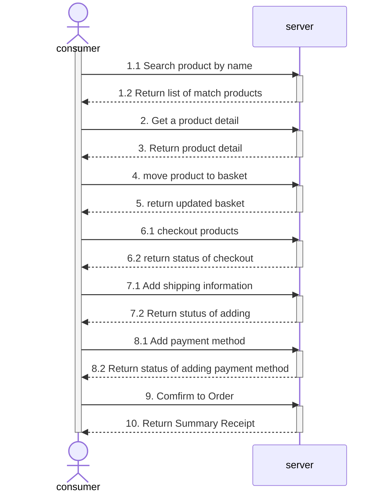

## Shopping Flow Design

 ##APIs Design

###Products
| Description        | Method | URI                   |
|--------------------|--------|-----------------------|
| Get all products   | GET    | /products             |
| Get product detail | GET    | /products/{productId} |

###Baskets
| Description                     | Method | URI                 |
|---------------------------------|--------|---------------------|
| Get user's basket               | GET    | /baskets/{basketId} |
| Create user's basket            | POST   | /baskets            |
| Update user's basket by product | UPDATE | /baskets            |

###Checkout
| Description                | Method | URI       |
|----------------------------|--------|-----------|
| checkout selected products | POST   | /checkout |

###Shipping
| Description              | Method | URI                    |
|--------------------------|--------|------------------------|
| Add shipping information | POST   | /shipping              |

###PaymentMethods
| Description                     | Method | URI             |
|---------------------------------|--------|-----------------|
| Get available payment methods   | GET    | /paymentMethods |

###Orders
| Description      | Method | URI     |
|------------------|--------|---------|
| create new order | POST   | /Orders |

# Models